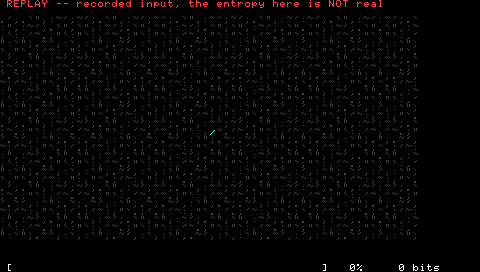
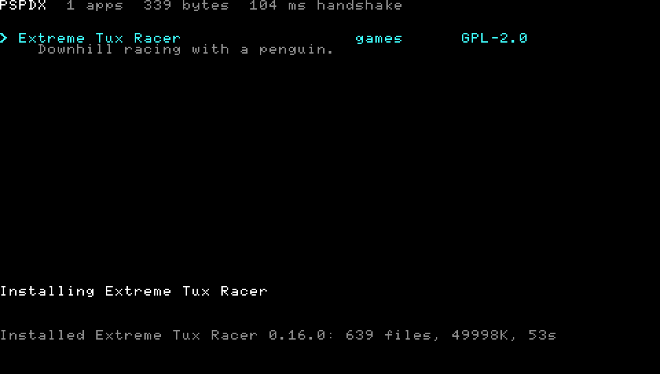
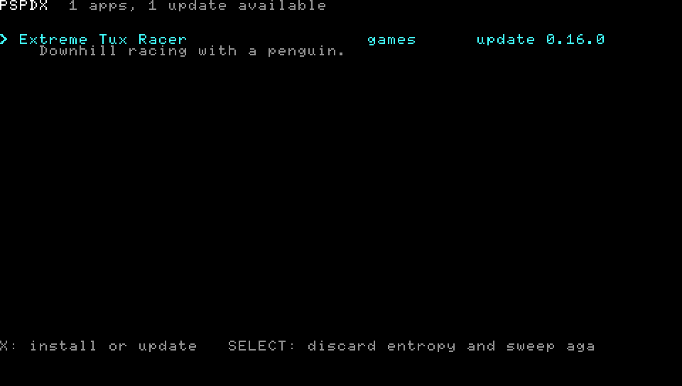

# PSPDX

**PSP Download Index** — the homebrew package index for the PlayStation Portable.

> The PSP model Sony never shipped.

The client fetches a catalog, installs a package and checks for updates. It
runs under PPSSPP; nobody has put it on real hardware yet.

## Where the keys come from

The console has no usable randomness of its own. `getentropy()` in pspsdk is
MT19937 reseeded from `time(NULL)` on every call, and the hardware generator in
the crypto chip is a kernel-only export a user-mode EBOOT cannot import at all.
So the entropy comes from a moving thumb, the same ritual PGP and TrueCrypt
performed with the mouse — the one source that is not part of the machine's own
determinism, and the one that works identically on hardware and in an emulator.

Covering a field rather than counting movements is deliberate: nervous wiggling
parks the stick against a stop where the ADC saturates and stops saying
anything, and a worn stick that drifts on its own would fill a naive counter but
not a grid. A run credits two bits per changed sample and reaches 256 bits in a
few seconds. The result is written to the Memory Stick, so the ritual happens
once. The recording above is a replayed input trace, which is why it says the
entropy in it is not real.

## What it does

| | |
|---|---|
|  | **Fetch the catalog.** One request, parsed with cJSON. About 200 bytes per entry, so a thousand apps is one 200 KB fetch. |
|  | **Install a package.** 44 MB through two redirects, sha256 verified, 639 files unpacked, then a single rename into `PSP/GAME/`. |
|  | **Check for updates.** One request per installed package to the author's own manifest, comparing `rev` as a number. |

Screenshots come from the app itself, which dumps its framebuffer to the stick.
A real PSP has no screen capture, and neither does a host whose desktop is
locked.

## Layout

| | |
|---|---|
| [`app/`](app/) | the on-device client: TLS 1.3, entropy off the analog stick, install |
| [`catalog/`](catalog/) | one file per app, folded into the `catalog.json` the client fetches |
| [`docs/`](docs/) | the design notes, including the approaches that were dropped and why |

Updates never go through the catalog. Each package's `.pspdx` manifest lives in
its author's own repository and is the only thing compared, which is why a stale
catalog costs nothing. Nothing is signed, and
[open-questions.md](docs/open-questions.md) argues why that is the right amount
of trust for now.
