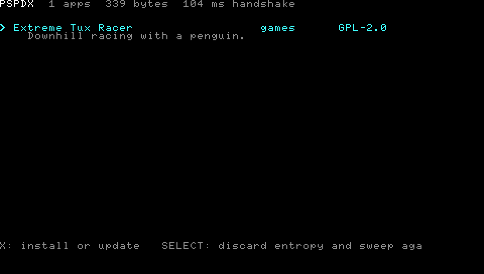

# PSPDX

**PSP Download Index** — the missing package manager for PSP homebrew.

Gives you a [catalog](https://github.com/chriopter/pspdx-catalog) of sick & current Brews for the PSP including updating them from a central place!



Runs under PPSSPP; nobody has put it on real hardware yet.

To get your open source licensed brew listed, send a PR to
[pspdx-catalog](https://github.com/chriopter/pspdx-catalog) or open an issue.

## Technical
- One request gets the whole index: [pspdx-catalog](https://github.com/chriopter/pspdx-catalog) is folded into a single `catalog.json`. The PSP pays per TLS handshake, not per byte.
- Downloads come from the author's own release. PSPDX hosts nothing and mirrors nothing.
- An author who publishes an `app.pspdx` gets updates on the device minutes later, with no change to the index. An author who has stopped answering is carried by the index instead.
- TLS 1.3, with the seed collected off the analog stick at startup, because the PSP has no usable PRNG.
- Every manifest sits on the same GitHub host, so one handshake covers the whole update check.

## The two files

An app is a catalog entry here and a manifest in its author's repository.
[manifest.md](manifest.md) is the long version.

<details>
<summary><b>Catalog entry</b> — what exists. In <a href="https://github.com/chriopter/pspdx-catalog">pspdx-catalog</a>, as <code>apps/&lt;id&gt;/app.json</code>.</summary>

```json
{
  "id": "io.github.chriopter.extremetuxracer",
  "name": "Extreme Tux Racer",
  "author": "chriopter",
  "summary": "Downhill racing with a penguin.",
  "category": "games",
  "license": "GPL-2.0",
  "repo": "https://github.com/chriopter/psp-tuxracer"
}
```

No version, so a stale catalog costs nothing -- unless the author has stopped
publishing, in which case the entry carries `rev`, `url` and `sha256` itself
and is the only source there is. An `icon.png`, `screenshot.png` or
`video.mp4` in the same directory is picked up by name --
[the catalog's README](https://github.com/chriopter/pspdx-catalog#encoding-a-video)
has the encoding the PSP can decode.

Copy: [`app.json.template`](app.json.template)

</details>

<details>
<summary><b><code>app.pspdx</code></b> — what is current. In the author's repository.</summary>

```json
{
  "schema": "https://github.com/chriopter/pspdx/blob/master/manifest.md",
  "id": "io.github.chriopter.extremetuxracer",
  "rev": 1789034382,
  "url": "https://github.com/chriopter/psp-tuxracer/releases/download/v0.16.0/extremetuxracer-psp.zip",
  "sha256": "2cd0a663535b613a2449fcd68c111b9f4301465aefdda4c6c3fce33e5cd8d231",
  "size": 44048460,
  "requires": { "ram_mb": 64 },
  "display": {
    "version": "0.16.0",
    "notes": "First release listed in PSPDX."
  }
}
```

`rev` is unix seconds and the only field compared. Found at `app.pspdx` on the
repository's default branch, so a catalog entry names a manifest only when the
file is elsewhere.

Copy: [`app.pspdx.template`](app.pspdx.template)

</details>

## What is listed

Four entries, which between them cover every shape the catalog has:

| | |
|---|---|
| [Extreme Tux Racer](https://github.com/chriopter/psp-tuxracer) | a real port: 44 MB, 639 files, GPL-2.0, manifest kept by its author |
| [Rust Raytracer](https://github.com/chriopter/psp-rust-raytracer) | a real demo, and the smallest thing that still looks like something |
| [PSPDX Test App](https://github.com/chriopter/psp-dx-testapp) | 69 KB of hello world, so a `rev` comparison can be watched without downloading 44 MB |
| [Abandoned Test App](https://github.com/chriopter/psp-dx-testapp-abandoned) | the same, with no manifest and no author: the index carries its release itself |

## Open

- **Entries that carry their own release.** The client reads `manifest` and
  nothing else, so an abandoned app is listed but not installable. It should
  take `rev`, `url` and `sha256` straight from the entry when they are there --
  which costs no request at all, the catalog is already in hand.
- **One connection for the whole update check.** Every manifest is on the same
  host; the client still opens a handshake per package. Twenty lines, and the
  largest win left.
- **A release watcher.** Nothing notices when an abandoned app upstream cuts a
  new release. A job in the catalog repository should, and open a commit.
- **Icons and video on the device.** `app/gui/image.c` draws stills. The Media
  Engine decodes H.264 in hardware and the catalog already carries the clips.
- **Real hardware.** It has only ever run in PPSSPP.
- **Nothing is signed**, so the index is trusted completely. Fine while one
  person writes it; not fine once a bot does.

---

<sup>To watch an update happen: bump `VERSION` in psp-dx-testapp, cut a release,
raise `rev` in its `app.pspdx`, and the client finds it within minutes. For the
abandoned one the same test runs the other way round -- the release is cut
upstream and the catalog entry is what gets edited.</sup>
