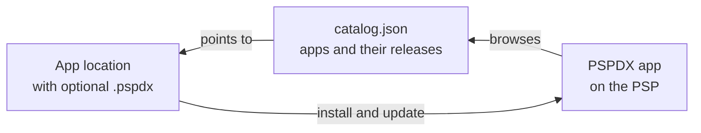

# PSPDX standard

**Two small JSON files that let a PSP install and update homebrew by itself**

**[→ Read the specification](https://chriopter.github.io/pspdx/)**

PSP homebrew is scattered over GitHub, forums and old archives, and installing or updating it takes a PC. With PSPDX, apps describe themselves in their repositories and catalogs fill in for the rest, so the PSP can find, install and update them directly.

## Overview

Three parts: an **app** is a homebrew, ideally with a `.pspdx` in its repository; a **catalog** is a `catalog.json` that lists many apps; and a **client** such as PSPDX on the PSP reads both.



### How it works

- **`.pspdx`:** the app author puts it next to the app to describe it.
- **Catalog:** provides cached metadata and release info from all listed `.pspdx` files, so update checks on the PSP take one request. If an app has no `.pspdx`, e.g. because it is abandoned or its author doesn't use the standard, the catalog provides the metadata itself.
- **Client:** keeps a copy of each installed app's `.pspdx`, so it can check for and download updates even without a catalog.

## Specification

### `.pspdx`

One app, in the root of its repository.

[Schema](https://chriopter.github.io/pspdx/schema/pspdx-v1.json) · [Fields and rules →](https://chriopter.github.io/pspdx/#pspdx-v1)

<details markdown="1">
<summary><b>Example</b> · a minimal <code>.pspdx</code></summary>

```json
{
  "schema": "https://chriopter.github.io/pspdx/schema/pspdx-v1.json",
  "source": "https://github.com/chriopter/pspdx-demo",
  "name": "PSPDX Demo",
  "category": "demo",
  "summary": "Hello, PSP. A demo listing for PSPDX."
}
```

</details>

### `catalog.json`

A list of many apps with their releases and pictures. For an abandoned app, the entry holds the fields its `.pspdx` would have.

[Schema](https://chriopter.github.io/pspdx/schema/catalog-v1.json) · [Fields and rules →](https://chriopter.github.io/pspdx/#catalog-v1)

<details markdown="1">
<summary><b>Example</b> · a <code>catalog.json</code> with one app</summary>

```json
{
  "schema": "https://chriopter.github.io/pspdx/schema/catalog-v1.json",
  "generated_at": "2026-09-14T22:25:44Z",
  "apps": [
    {
      "id": "io.github.chriopter.pspdxdemo",
      "source": "https://github.com/chriopter/pspdx-demo",
      "name": "PSPDX Demo",
      "category": "demo",
      "installdir": "PSP/GAME/PSPDXDemo",
      "summary": "Hello, PSP. A demo listing for PSPDX.",
      "author": "chriopter",
      "license": "MIT",
      "description": "A hello world for the PSP, published the way a listed app is: a .pspdx in the repository, a release with the EBOOT.\nX says hello again, HOME leaves.",
      "releases": [
        {
          "tag": "v0.1.2",
          "published_at": "2026-09-12T23:20:26Z",
          "url": "https://github.com/chriopter/pspdx-demo/releases/download/v0.1.2/pspdx-demo.zip",
          "size": 123707,
          "sha256": "cb5737fbf5aae1fcbcfcdbc7dcc85d761559d4c21a83b8366d39c227598273e4",
          "eboot_md5": "5d7f8a921fb99b5df2560ffade01d4b4",
          "changelog": "**Full Changelog**: https://github.com/chriopter/pspdx-demo/compare/v0.1.1...v0.1.2"
        }
      ],
      "media": {
        "icon": "apps/io.github.chriopter.pspdxdemo/icon-f39ad127.png",
        "screenshots": [
          "apps/io.github.chriopter.pspdxdemo/picture-3d60f75d.png"
        ],
        "video": "apps/io.github.chriopter.pspdxdemo/film-a4eb3006.pmf",
        "sound": "apps/io.github.chriopter.pspdxdemo/sound-90636786.at3"
      }
    }
  ]
}
```

</details>

## Implementations

- [pspdx-app](https://github.com/chriopter/pspdx-app) — the client for the PSP: browses catalogs, installs release ZIPs, checks for updates at start
- [pspdx-catalog](https://github.com/chriopter/pspdx-catalog) — the main catalog: rebuilds itself every hour, reads each listed repo's `.pspdx` and fetches its latest releases
- [pspdx-demo](https://github.com/chriopter/pspdx-demo) — a minimal homebrew with its own `.pspdx` and a release
- [pspdx-demo-abandoned](https://github.com/chriopter/pspdx-demo-abandoned) — a homebrew without a `.pspdx`, listed by the catalog
