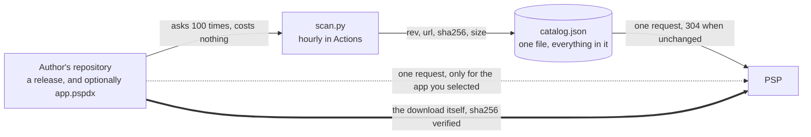

# Architecture

PSPDX is an index, not a host. It knows what exists and what the current
version of it is; the files themselves stay in their authors' releases.

The principle everything follows from: **poll where it is free, ask once where
it is expensive.** A 333 MHz handheld on 802.11b pays over a second for a TLS
handshake. GitHub Actions pays nothing for the same question, and an unchanged
repository answers `304`. So the hundred questions are asked in CI, and the
console asks one.

## Who owns what

| | |
|---|---|
| **Catalog entry** | Name, summary, category, licence: written once by a person. The release block — `rev`, `url`, `sha256`, `size` — belongs to `scan.py` and is never edited by hand. |
| **`scan.py`** | Asks GitHub what the newest release is, downloads it, hashes the bytes it actually received, and looks inside the archive. A release that moves the package is refused, not published. |
| **The author** | Nothing is required. An optional `app.pspdx` with the current release makes updates visible in minutes instead of within the hour. |

## What the console does

One conditional fetch of `catalog.json` at startup, usually answered `304`.
That is the whole list, every version, every hash — the update check costs no
further request.

When you select an app, and only then, it fetches that app's `app.pspdx` if the
entry names one. One request, at the moment you are already waiting. This is
how the PSP's own game patches worked: a small file per title, fetched for the
title you launched, never for the library.

**The higher `rev` wins.** A stale author manifest is therefore harmless, which
matters, because they go stale — the one in `psp-tuxracer` says 0.16.0 while
its releases are at 0.21.0. Taking part helps; not taking part costs nothing;
taking part badly costs nothing either.

## Not yet true

The client still looks for a manifest in every entry and cannot read the
release out of the catalog, so it currently lists four apps and installs none.
And `find_game_dir()` demands `PSP/GAME/<dir>/`, a layout two of sixteen
surveyed archives actually use.
