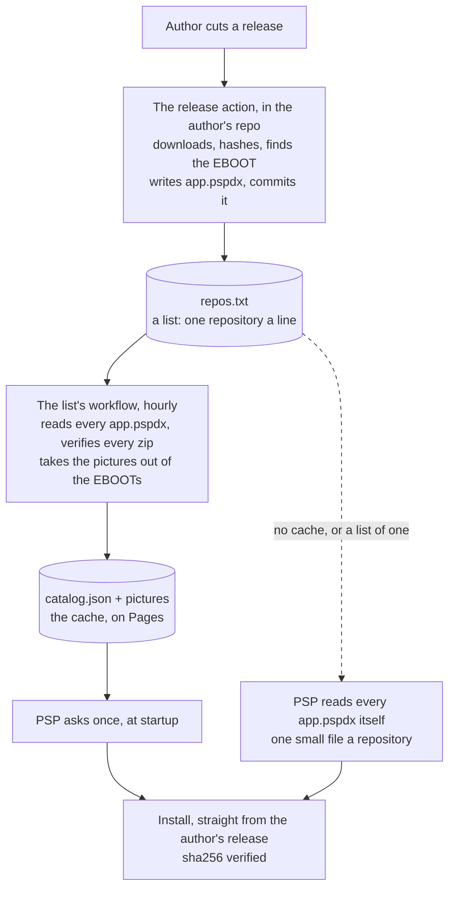

# Architecture

PSPDX is an index, not a host. The truth about an app is one file in its
author's own repository, `app.pspdx`; the files themselves stay in the
author's release; the index is a cache of what the files say.

The principle everything follows from: **poll where it is free, ask once where
it is expensive.** A 333 MHz handheld on 802.11b pays over a second for a TLS
handshake. GitHub Actions pays nothing for the same question. So the hundred
questions are asked in CI, and the console asks one, and can still ask the
hundred itself over a single connection when no cache answers.

## Who owns what

| | |
|---|---|
| **The author** | The first half of `app.pspdx`: id, name, summary, category, licence, repository. Written once. And the pictures, in the `EBOOT.PBP` where Sony put them: ICON0, PIC1, ICON1, SND0. |
| **The release action** | The second half: version, rev, url, sha256, size, root. Written at every release, from the bytes GitHub actually serves. Never edited by hand. |
| **A list** | Which repositories. Anyone's text file. The one the console ships with is `repos.txt` in pspdx-catalog. |
| **A cache** | A workflow that reads the list, verifies every package once, mirrors the pictures, and publishes one `catalog.json`. Stateless: nothing is committed, the next run builds it again from the files. |

## What the console does

One fetch of the cache's `catalog.json` at startup. That is the whole list,
every version, every hash, every picture's URL; the update check costs no
further request.

When there is no cache, or the source is a single repository someone typed
in, the console reads each `app.pspdx` itself: one small file a repository,
all on the same host. Each is its own connection today, a handshake apiece;
keeping one connection open across them is the next step.

**The higher `rev` wins.** A cache that has fallen behind the author's file
is harmless: the record on the stick says what is installed, the file says
what is published, and the larger number is the update.

## Trust

The cache proves nothing and is not asked to. The console checks the zip
against the `sha256` in `app.pspdx`, and that file sits in the author's own
repository under the author's own account. A list is trusted the way a
package source is: whoever wrote it chose what is on it.
