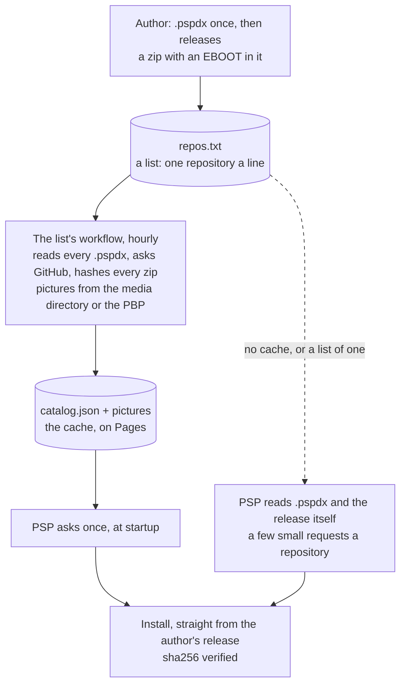

# Architecture

PSPDX is an index, not a host. The truth about an app is its repository:
a `.pspdx` file that says what it is, a release that says which version,
an EBOOT that carries the pictures. The index is a cache of what they say.
An author writes six lines once and never touches them for a release.

The principle everything follows from: **poll where it is free, ask once where
it is expensive.** A 333 MHz handheld on 802.11b pays over a second for a TLS
handshake. GitHub Actions pays nothing for the same question. So the hundred
questions are asked in CI, and the console asks one, and can still ask the
hundred itself over a single connection when no cache answers.

## Who owns what

| | |
|---|---|
| **The author** | `.pspdx`: name, category, and what GitHub cannot say. The release: a zip with an `EBOOT.PBP`. The media: ICON0, PIC1, and if they like ICON1 and SND0, in a directory or in the PBP. |
| **A list** | Which repositories. Anyone's text file. The one the console ships with is `repos.txt` in pspdx-catalog. |
| **A cache** | A workflow that reads the list and every `.pspdx`, asks GitHub, verifies every package once, and publishes one `catalog.json` with the pictures. Stateless: nothing is committed, the next run reads it all again. |
| **The console** | Takes the cache when it answers, asks GitHub at the origin for what it did not cover, and pictures what is installed from the EBOOT on the stick. |

## What the console does

One fetch of the cache's `catalog.json` at startup. That is the whole list,
every version, every hash, every picture's URL; the update check costs no
further request.

When there is no cache, or the source is a single repository someone typed
in, the console reads the `.pspdx` and the pictures from
`raw.githubusercontent.com` and the release from GitHub's API: a few small
requests a repository, each its own connection today. It gets no hash that
way and checks the size instead.

**The higher `rev` wins.** A cache that has fallen behind the author's file
is harmless: the record on the stick says what is installed, the file says
what is published, and the larger number is the update.

## Trust

The cache proves nothing and is not asked to. The zip comes from the
author's own release under the author's own account, over TLS; the cache's
`sha256` guards the transport, and without a cache the size does. A list is
trusted the way a package source is: whoever wrote it chose what is on it.
